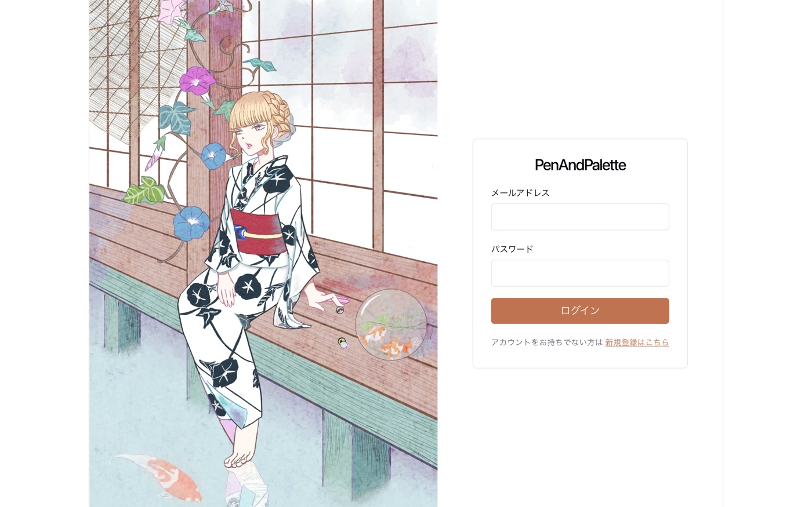
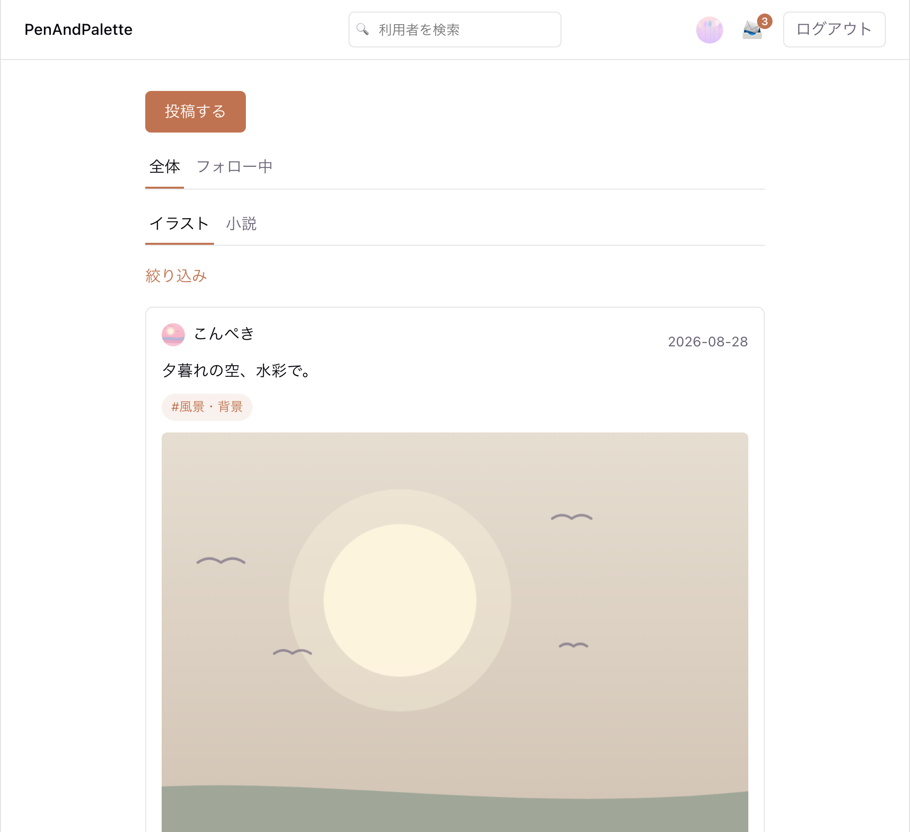
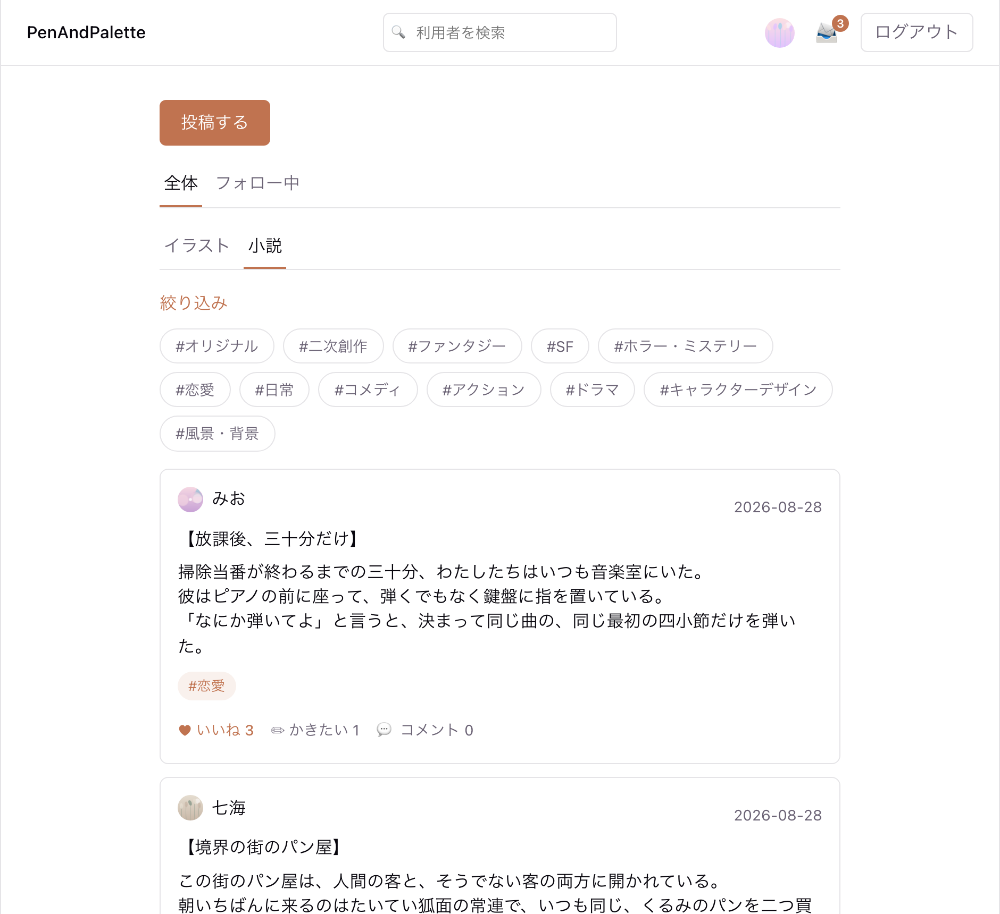
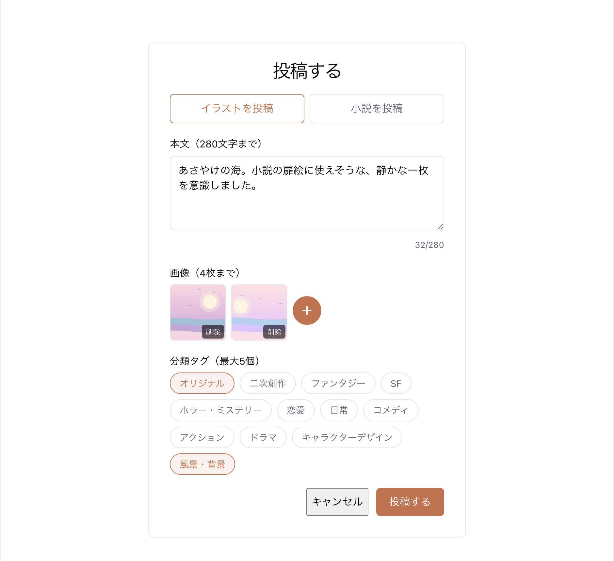
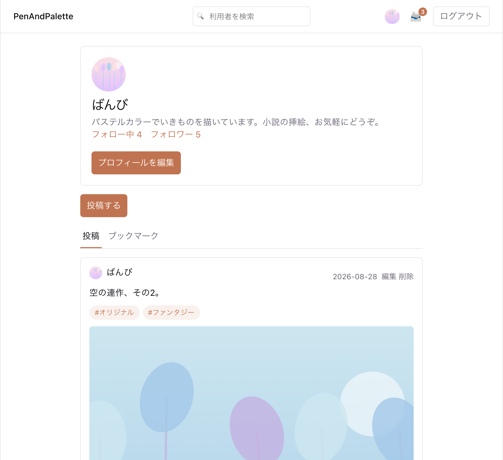
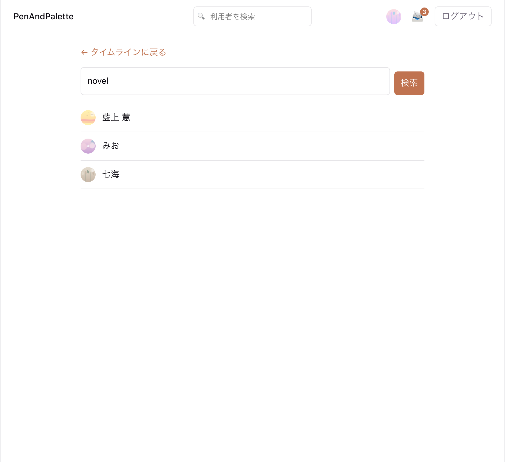
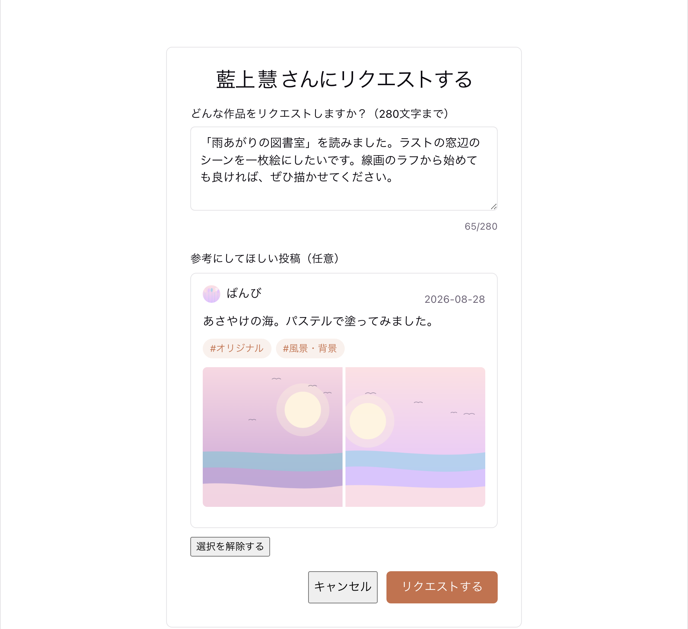
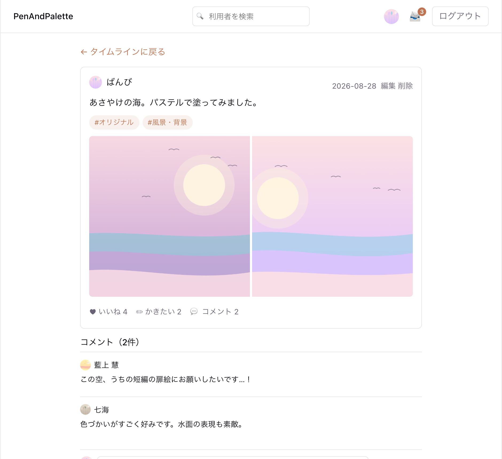
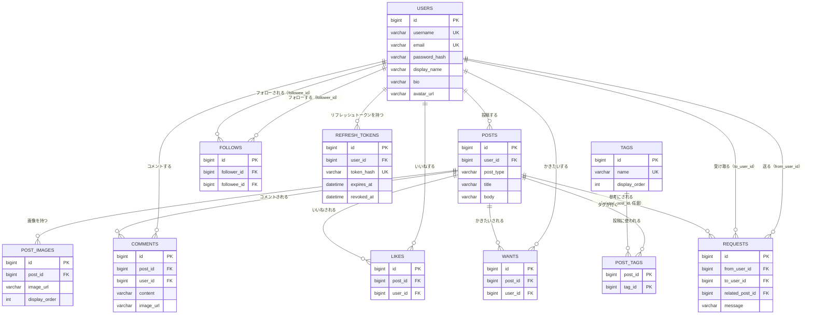
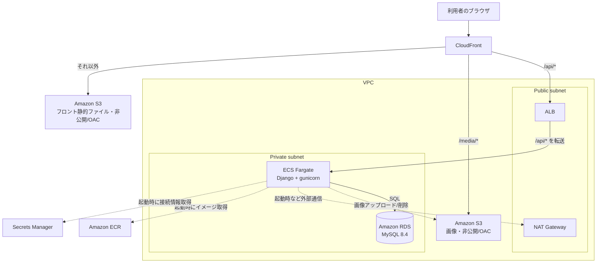

# PenAndPalette

[](https://github.com/marinnk/PenAndPalette/actions/workflows/ci.yml)

文字書きさんとイラストを描く人を繋ぐ、創作特化のSNS風Webアプリケーション（学習用）。

> RaiseTech 受講の学習成果物です。営利目的ではなく、要件定義〜設計〜実装〜テスト〜AWS へのデプロイまでの一連を自分で通すことを目的にしています。

## プロジェクト概要

小説（テキスト作品）とイラストの両方を投稿でき、他利用者の作品に対して「いいね」「コメント」に加えて、「この小説にイラストを描かせてほしい」「このイラストのキャラクターで小説を書かせてほしい」といったリクエストを送り合える点が特徴です。

詳細な仕様は以下のドキュメントを参照してください。

- [要件定義書](docs/requirements.md)：何を・なぜ作るか
- [機能一覧](docs/features/index.md)：機能ごとの詳しい仕様
- [画面設計](docs/screen-design.md)：画面一覧・画面遷移・ワイヤーフレーム
- [基本設計書](docs/basic-design.md)：技術スタック・データベース設計（ER図）・API設計など、どう作るか
- [インフラ構成書](docs/infrastructure-design.md)：本番AWS構成（Terraform）・デプロイ手順

## 技術スタック

| 区分 | 技術 |
| --- | --- |
| バックエンド | Python 3.14 / Django 6.1 / Django REST Framework 3.18（`djangorestframework-simplejwt` で JWT 認証） |
| フロントエンド | Vue 3.5（TypeScript）/ Vite 8 / Pinia / Vue Router / axios |
| データベース | MySQL 8.4 |
| 画像ストレージ | Amazon S3（`django-storages` + `boto3`。ローカル開発では MinIO で代替） |
| テスト | pytest-django ／ Vitest + Vue Testing Library ／ Playwright（E2E）／ k6・Lighthouse（負荷・監査、手動） |
| Lint・整形 | ruff（backend）／ ESLint + Prettier（frontend、`eslint-plugin-vuejs-accessibility` 込み） |
| 本番インフラ | AWS（CloudFront / ECS Fargate / RDS for MySQL / S3 / Secrets Manager）を Terraform で構築 |
| CI/CD | GitHub Actions（PR ごとに Lint・テスト・ビルド・E2E を自動実行／デプロイは手動実行・OIDC 認証） |

構成の詳細は[基本設計書](docs/basic-design.md)・[インフラ構成書](docs/infrastructure-design.md)を参照。

### 技術選定の理由

本アプリは RaiseTech の学習として、姉妹プロジェクト [RaiseTechSNS](../RaiseTechSNS)（Java / Spring Boot + PostgreSQL）と**対になるように**開発しています。両者で**インフラ構成（AWS の構築方針）と開発フロー（Issue 駆動・PR ベース・CI 必須）を共通化**し、**アプリ層の言語・フレームワーク・DB だけを入れ替える**ことで、設計判断のどこがフレームワーク固有で、どこが普遍的なのかを実装を通じて確かめることを狙いにしています。

- **バックエンド：Django / Django REST Framework** — ORM・マイグレーション・管理画面・認証基盤が標準で揃い、1人でも広い範囲をカバーできる。DRF のシリアライザ層が「ビューは薄く、入出力の検証・整形はシリアライザ、業務ロジックはサービス／モデル」という本プロジェクトの責務分離とそのまま噛み合う。一覧の集計値も ORM の `annotate()`（`Count`・`Exists`）で N+1 を避けやすい。
- **フロントエンド：Vue 3（`<script setup>` + TypeScript）** — 単一ファイルコンポーネントでテンプレート・ロジック・スタイルをまとめつつ、API 通信は composable（`useXxx`）に切り出してコンポーネントを表示に専念させられる。Router・Pinia・ビルドツール（Vite）が公式に統合されており、周辺ライブラリの選定に迷わない。
- **データベース：MySQL 8.4** — RaiseTechSNS の PostgreSQL とあえて変えて両方を経験する。データモデルは素直なリレーショナル構造で PostgreSQL 固有機能（配列・JSONB 等）を必要としないため MySQL で十分。AWS では RDS for MySQL としてマネージド運用でき、Django からの利用実績も厚い。
- **画像ストレージ：Amazon S3（ローカルは MinIO）** — ユーザーがアップロードするファイルはコンテナの一時ディスクや DB ではなくオブジェクトストレージに置く定石。MinIO は S3 互換 API のため、`django-storages` + `boto3` の同じコードがローカルと本番の両方で動き、「本番でしか動かない」保存処理を作らずに済む。
- **本番インフラ：CloudFront + ECS Fargate + RDS を Terraform で** — RaiseTechSNS で確立した構成を再利用し、学習の労力をアプリ側に寄せる。Fargate で OS 管理を不要にし、CloudFront で SPA・API・画像を1ドメインに集約することで Cookie 認証がクロスオリジンの複雑さなしに成立する。環境全体を Terraform で `apply` / `destroy` でき、学習用途としてコストを抑えるため使わない間は撤去できる。

## 機能一覧

[機能一覧](docs/features/index.md)の **F-1〜F-11 をすべて実装済み**。

- **F-1 ログイン**：会員登録・ログイン・ログアウト。JWT アクセストークン＋リフレッシュトークンを HttpOnly Cookie で保持（フロントはトークン値を扱わない）
- **F-2 タイムライン**：全体／フォロー中、イラスト／小説の切り替え、分類タグでの絞り込み、`id` カーソルベースの無限スクロール、新着投稿のポーリング＋通知バナー
- **F-3 投稿**：イラスト／小説の2種別、画像0〜4枚、自分の投稿の編集・削除
- **F-4 コメント**：画像添付・編集・削除
- **F-5 いいね ／ F-10 かきたい**：冪等な付与／解除（トグルではなく `POST`／`DELETE` の2エンドポイント）
- **F-6 リクエスト**：個人宛て、参考投稿の指定、ヘッダー通知バッジ
- **F-7 フォロー**：フォロー／アンフォロー、フォロー中・フォロワー一覧
- **F-8 プロフィール**：カード表示、投稿／ブックマークタブ、プロフィール編集・アイコン
- **F-9 ユーザー検索**：ユーザー名・表示名の部分一致
- **F-11 分類タグ**：投稿への付与（固定12種）・タイムラインでの絞り込み

### スクリーンショット

> ローカル環境で撮影したものです。投稿・アイコンの画像はプレースホルダー、ログイン画面の背景はオリジナルイラストです。

#### ログイン／新規登録（F-1）



メールアドレス＋パスワードでログイン。認証は JWT を HttpOnly Cookie で保持し、フロントはトークン値を扱いません。左のイラストはオリジナル。

#### タイムライン（F-2 / F-11）

<p>
  
  
</p>

全体／フォロー中、イラスト／小説の切り替え、分類タグでの絞り込み、`id` カーソルベースの無限スクロール、新着投稿の通知バナー。

#### 投稿作成（F-3 / F-11）



イラスト／小説の2種別。イラストは画像1〜4枚、小説はタイトル・本文（＋任意のカバー画像）、分類タグは最大5個。

#### プロフィール／ユーザー検索（F-8 / F-9）

<p>
  
  
</p>

プロフィールカード（アイコン・自己紹介・フォロー数）、投稿／ブックマークタブ、プロフィール編集。ユーザー名・表示名でのユーザー検索。

#### リクエスト／リアクション（F-4 / F-5 / F-6 / F-10）

<p>
  
  
</p>

「いいね」「かきたい」、コメント（画像添付可）、個人宛てのリクエスト（参考投稿の指定、ヘッダーの通知バッジ）。

## APIドキュメント

REST API。`/api/` プレフィックスに統一、JSON キーはスネークケース、認証は HttpOnly Cookie の JWT（HTTP ヘッダーへの手動付与なし）、ON/OFF 操作は冪等な `POST`／`DELETE` の2エンドポイント。エンドポイントごとのリクエスト／レスポンス仕様・クエリパラメータの詳細は [基本設計書 6章 API設計](docs/basic-design.md#6-api設計) を参照してください。

| グループ | 主なエンドポイント |
| --- | --- |
| 認証 | `POST /api/auth/register` ・ `/login` ・ `/logout` ・ `/refresh`、`GET /api/auth/me` |
| 投稿 | `GET`・`POST /api/posts`、`GET`・`PUT`・`DELETE /api/posts/{id}`（一覧は `before_id`/`after_id` のカーソル方式、`scope`・`post_type`・`tag_id`・`user_id`・`liked_by` で絞り込み） |
| コメント | `GET`・`POST /api/posts/{id}/comments`、`PUT`・`DELETE /api/comments/{id}` |
| いいね・かきたい | `POST`・`DELETE /api/posts/{id}/likes`、`POST`・`DELETE /api/posts/{id}/wants` |
| プロフィール・フォロー | `GET /api/users/{id}`、`PUT /api/users/me`、`POST`・`DELETE /api/users/me/avatar`、`POST`・`DELETE /api/users/{id}/follow`、`GET /api/users/{id}/followers` ・ `/following` |
| リクエスト | `POST /api/users/{id}/requests`、`GET /api/requests/received` |
| ユーザー検索 | `GET /api/users?q=<キーワード>` |
| 分類タグ | `GET /api/tags` |

一覧の集計値（いいね数・フォロー数・`liked_by_me` 等）はループでの個別クエリではなく Django ORM の `annotate()`（`Count`・`Exists` サブクエリ）で1回の SELECT にまとめ、N+1 を避けています。

## ER図



カラムの型・文字数上限・設計判断（いいね数を `posts` に持たず COUNT で集計する等）は [基本設計書 4章 データベース設計](docs/basic-design.md#4-データベース設計) を参照。

## アーキテクチャ図

本番環境（AWS）。フロント（静的ファイル）・API（コンテナ）・画像（S3）を CloudFront の1ドメイン配下にまとめ、Cookie が同一オリジンで送信されるようにしています。



構築手順・コンポーネントの選定理由は[インフラ構成書](docs/infrastructure-design.md)を参照。

## 動かし方（ローカル）

固定ポート：バックエンド **8000** / フロントエンド **5173** / MySQL **3306**（競合したら別ポートに逃がさず、そのプロセスを止めてから起動する）。

```sh
# 1. MySQL・MinIO（画像ストレージのローカル代替）を起動
docker compose up -d

# 2. バックエンド（Django REST API → http://localhost:8000）
cd backend
python3 -m venv .venv && source .venv/bin/activate   # 初回のみ
pip install -r requirements.txt                       # 初回・依存追加時のみ
python manage.py migrate
python manage.py runserver 8000

# 3. フロントエンド（Vue → http://localhost:5173）
cd frontend
npm install                                           # 初回・依存追加時のみ
npm run dev
```

詳しい注意点は[.claude/skills/run-app/SKILL.md](.claude/skills/run-app/SKILL.md)を参照してください。

### プロジェクト構成

```
.
├── backend/    # Django（REST API）
├── frontend/   # Vue.js（画面）
├── e2e/        # Playwright E2Eテスト（scenarios は CI で自動実行 / performance は手動）
├── perf-tests/ # k6 負荷試験・Lighthouse 監査（手動実行）
├── terraform/  # 本番AWSインフラ（S3+CloudFront / ECS Fargate / RDS）
├── docs/       # 要件定義・設計ドキュメント
└── docker-compose.yml   # MySQL・MinIO（ローカル開発用）
```

## テスト

```sh
# バックエンド（要 docker compose up -d db：pytest-django が同じ MySQL 上に使い捨てDBを作る）
cd backend && ruff check . && ruff format --check . && pytest

# フロントエンド
cd frontend && npm run lint && npm run test && npm run build

# E2E（Playwright、scenarios は CI で自動実行）
cd e2e && npm run test:scenarios

# 負荷試験・監査（手動のみ）：k6 / Lighthouse ─ 詳細は .claude/skills/perf-test/SKILL.md
```

- backend（pytest-django）・frontend（Vitest）・E2E（Playwright scenarios）のテストを整備済み。
- **Lint／テスト／ビルド／E2E（scenarios）は PR ごとに GitHub Actions（[.github/workflows/ci.yml](.github/workflows/ci.yml)）で自動実行**しています。
- E2E の performance トラック（`e2e/performance`、ブラウザ実測タイミング）と、k6 負荷試験・Lighthouse 監査（`perf-tests/`）は手動実行です（CI には含めない）。

## デプロイ実績

2026-08-28、`terraform/` のコードから AWS 本番環境を構築し、アプリをデプロイして全機能の疎通を確認しました。

| 項目 | 内容 |
| --- | --- |
| 本番URL（当時） | `https://dpedkz9y01bvi.cloudfront.net` ※現在は撤去済みでアクセスできません |
| デプロイ | GitHub Actions（`deploy.yml`、手動実行・OIDC 認証）でイメージビルド → ECS 再デプロイ → フロント S3 sync → CloudFront invalidation |
| 確認したこと | `/api/health` = `{"status":"ok"}`、ECS 1/1 RUNNING、フロント 200、会員登録 API 201、未認証で `/api/posts` 401、ブラウザで主要画面の動作 |
| 撤去 | 確認後に `terraform destroy` で全 50 リソースを削除（学習用途・コスト回避のため） |

`terraform apply` → デプロイ → 確認 → `terraform destroy` の一連は再現可能な状態でコード化しています（手順は[インフラ構成書](docs/infrastructure-design.md) 7章の Runbook）。

## 今後の予定

学習用途として一区切りついているため、以下は「やるとしたら」の候補です。

- 独自ドメイン取得と ACM 証明書（現状は `*.cloudfront.net` の共有ドメイン）
- Terraform state のリモートバックエンド化（S3 + DynamoDB ロック。現状はローカル管理）
- リクエストの見落とし対策：メール等の外部通知・既読管理（現状は通知バッジのみ）
- k6・Lighthouse の結果を CI に載せて閾値割れで落とす運用
