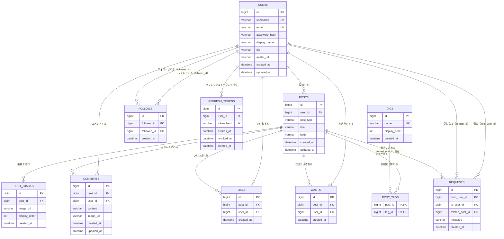

# 基本設計書：PenAndPalette

[← 要件定義書に戻る](requirements.md)

本書は、[要件定義書](requirements.md)・[機能一覧](features/index.md)・[画面設計](screen-design.md)で定めた「何を・なぜ」作るかを踏まえ、「どう作るか」（技術スタック・システム構成・データベース設計など）を定めるものです。

## 1. システム構成

- フロントエンド（Vue.js）とバックエンド（Django / Django REST Framework）を分離した構成とする
- フロントエンドはSPA（Single Page Application）として動作し、バックエンドが提供するREST APIと通信する
- バックエンドはDBおよび画像ストレージとやり取りし、フロントエンドにJSON形式でデータを返す

構成イメージ：

```
[ブラウザ] ⇔ [フロントエンド: Vue.js] ⇔ (REST API) ⇔ [バックエンド: Django/DRF] ⇔ [DB: MySQL]
                                                                    ⇕
                                                        [画像ストレージ: S3（開発時はMinIO）]
```

## 2. 技術スタック

| 区分 | 技術 |
|---|---|
| バックエンド | Python / Django（Django REST Framework） |
| フロントエンド | Vue.js |
| データベース | MySQL |
| 画像ストレージ | Amazon S3（ローカル開発ではMinIOで代替） |

姉妹プロジェクト[RaiseTechSNS](../../RaiseTechSNS)と同じインフラ構成（AWS上の構築方針等）を踏襲しつつ、使用言語・フレームワークを変えて実装する（DBもRaiseTechSNSのPostgreSQLではなくMySQLを採用する）。バージョンやAPI設計などの詳細は、実装着手時にあらためて確定し本書を更新する。認証方式は3章のとおり確定済み。

## 3. 認証方式

姉妹プロジェクト[RaiseTechSNS](../../RaiseTechSNS/docs/basic-design.md)（JWTベースのアクセストークン＋リフレッシュトークン方式、HttpOnly Cookie保持）を踏襲する。バックエンドがDjango REST Frameworkである点に合わせ、実現方法のみ読み替える。

- **方式**：`djangorestframework-simplejwt`を用いた、アクセストークン＋リフレッシュトークンの2種類のJWTによる認証方式を採用する
- **トークンの保存場所**：どちらのトークンもHttpOnly Cookie（JavaScriptから読み取れない）で保持し、XSSによるトークン窃取のリスクを下げる。フロントエンド（Vue）はトークンの値を一切扱わず、ブラウザが自動的にCookieを送信することでAPIリクエストを認証する（HTTPヘッダーへの手動付与は行わない）
  - DRFの標準はAuthorizationヘッダーでのトークン送信を前提とするため、Cookieからトークンを読み取るカスタム認証クラス（例：`CookieJWTAuthentication`）を実装し、ログイン・リフレッシュ用のビューでCookieを`Set-Cookie`する
- **アクセストークン**（`access_token`Cookie）：署名付きJWT。有効期限は短く（デフォルト15分）、期限切れ後はAPIリクエストが401になる
- **リフレッシュトークン**（`refresh_token`Cookie）：ランダムな不透明トークン（JWTではない）。有効期限は長く（デフォルト14日）、DBにハッシュ値のみを保存して失効管理する。認証系エンドポイント（`/api/auth/`配下）以外には送られないようCookieの送信範囲（`Path`属性）を絞る
  - アクセストークンが失効した場合、フロントエンドは`POST /api/auth/refresh`を呼び、リフレッシュトークンをもとにアクセストークン・リフレッシュトークンの両方を再発行（ローテーション）する
  - ローテーションのたびに使用済みのリフレッシュトークンは失効させ、同じトークンの再利用はできない。既に失効済みのトークンが再度使われた場合はトークン漏えいの兆候とみなし、そのユーザーの全リフレッシュトークンを失効させる
  - ログアウト時は、両方のCookieを失効させると同時に、DB上のリフレッシュトークンも失効させる（クライアント側でCookieを消すだけでなく、サーバー側でも無効化する）
- サーバー側はアクセストークンの検証のみで本人確認するステートレス方式（リフレッシュトークンの失効状態を除き、セッション状態を保持しない）
- パスワードは平文で保存せず、Djangoの標準パスワードハッシャー（PBKDF2）でハッシュ化して保存する

### 3.1 CORS・Cookie送信（フロント/バックエンドの別オリジン対策）

- **開発環境**：Vue（Vite dev server、例`http://localhost:5173`）とDjango（例`http://localhost:8000`）はポートが異なる別オリジンだが、どちらも`localhost`のため「同一サイト」であり、Cookieの`SameSite=Lax`のままでも送信自体は行われる。ただしブラウザのCORSポリシーは別途オリジン単位で働くため、`django-cors-headers`を導入して`CORS_ALLOWED_ORIGINS`に開発用オリジンを明示的に許可し、`CORS_ALLOW_CREDENTIALS = True`を設定する。フロントのAPIクライアント（axios等）も`withCredentials: true`（Fetch APIなら`credentials: "include"`）を指定し、Cookieを送信できるようにする
- **本番環境**：フロントエンド・バックエンドAPIが、AWSのデフォルトドメイン同士（例：CloudFrontの`*.cloudfront.net`とALBの`*.elb.amazonaws.com`）のように登録ドメインが異なる「別サイト」構成になる場合、`SameSite=Lax`のCookieはブラウザから送信されない。姉妹プロジェクトRaiseTechSNSも同じ制約に直面し、CloudFrontのパスベースルーティング（`/api/*`をALBへ、それ以外をS3へ）でフロント・バックエンドを同一オリジン化する対応を取っている（[RaiseTechSNS/docs/infrastructure-design.md 4章](../../RaiseTechSNS/docs/infrastructure-design.md#4-フロントとapiの同一オリジン化cookie対策)）。PenAndPaletteも同様の構成が必要になる見込みで、詳細は7章「インフラ構成」の検討時に確定する

## 4. データベース設計

### 4.1 エンティティ一覧

| エンティティ | 概要 |
|---|---|
| 利用者（users） | 会員登録した利用者。ユーザー名・メールアドレス・パスワードハッシュ・表示名・自己紹介・アイコン画像URLを持つ |
| 投稿（posts） | イラスト投稿（画像必須、本文任意280文字まで）または小説投稿（タイトル・本文必須、本文4000文字まで、画像任意）のいずれか。分類タグを最大5個まで付けられる |
| 投稿画像（post_images） | 投稿に添付された画像（1投稿につき最大4件、任意） |
| 分類タグ（tags） | 投稿に付ける分類の候補。アプリがあらかじめ用意した固定の一覧（利用者は追加できない） |
| 投稿分類タグ（post_tags） | 投稿と分類タグの中間テーブル（多対多）。1投稿につき0〜5個まで |
| コメント（comments） | 投稿へのコメント。画像を1枚まで添付できる |
| いいね（likes） | 投稿へのいいね |
| かきたい（wants） | 投稿への「かきたい」（創作意欲の表明） |
| フォロー（follows） | 利用者同士のフォロー関係 |
| リクエスト（requests） | ある利用者から別の利用者へ、個人宛てに送る創作の依頼 |
| リフレッシュトークン（refresh_tokens） | JWT認証のリフレッシュトークン。トークンのハッシュ値・有効期限・失効日時を持つ |

### 4.2 テーブル定義

日時カラムの型は`DATETIME`とする。MySQLには（PostgreSQLの`TIMESTAMPTZ`のような）タイムゾーン付きの型が無いため、Django側で`USE_TZ = True`のままUTCのnaive datetimeとして保存し、表示時にフロントエンド（またはDjango）でローカルタイムゾーンに変換する方針とする。

#### users

| カラム | 型 | 制約 | 説明 |
|---|---|---|---|
| id | BIGINT | PK, AUTO_INCREMENT | |
| username | VARCHAR(50) | NOT NULL, UNIQUE | |
| email | VARCHAR(255) | NOT NULL, UNIQUE | |
| password_hash | VARCHAR(255) | NOT NULL | 平文では保存せずハッシュ化して保存 |
| display_name | VARCHAR(50) | NOT NULL | |
| bio | VARCHAR(160) | NULL可 | 自己紹介 |
| avatar_url | VARCHAR(500) | NULL可 | アイコン画像のURL（S3） |
| created_at | DATETIME | NOT NULL | |
| updated_at | DATETIME | NOT NULL | |

#### posts

| カラム | 型 | 制約 | 説明 |
|---|---|---|---|
| id | BIGINT | PK, AUTO_INCREMENT | |
| user_id | BIGINT | FK→users.id, NOT NULL | 投稿者 |
| post_type | VARCHAR(20) | NOT NULL, CHECK制約：'illustration'または'novel' | 投稿種別。投稿作成画面（S04）でどちらの形式を使ったかで自動的に決まる（利用者が別途選ぶ項目ではない） |
| title | VARCHAR(100) | NULL可 | タイトル。小説投稿では必須、イラスト投稿では常にNULL |
| body | VARCHAR(4000) | NULL可 | 本文。イラスト投稿では任意（0〜280文字、NULLもありうる）、小説投稿では必須（1〜4000文字） |
| created_at | DATETIME | NOT NULL | |
| updated_at | DATETIME | NOT NULL | |

投稿の入力ルールは`post_type`により異なる。DB制約ではなくアプリケーション側のバリデーションで実現する：
- イラスト投稿（`post_type='illustration'`）：画像が1〜4枚必須。本文は任意（0〜280文字）
- 小説投稿（`post_type='novel'`）：タイトル（1〜100文字）・本文（1〜4000文字）が必須。画像は任意で最大1枚（カバー画像）

`body`カラムの型がVARCHAR(4000)なのは小説投稿の上限に合わせたためで、イラスト投稿では引き続きアプリケーション側で0〜280文字に制限する（DBカラムの上限＝その種別で許される上限、ではない点に注意）。

`MAX_POST_IMAGES`（投稿画像の上限4枚。`backend/posts/serializers.py`と`frontend/src/composables/postImageValidation.ts`の2箇所に同じ値を複製する実装上の慣習）と同様に、本文文字数の上限（イラスト280／小説4000）・タイトル文字数の上限（100）・画像枚数の上限（イラスト最大4／小説カバー最大1）も、バックエンド・フロントエンドそれぞれに定数として複製する実装になる見込み。実装時（Issue 2・3）はこれらを必ず揃えて変更すること。

#### tags

| カラム | 型 | 制約 | 説明 |
|---|---|---|---|
| id | BIGINT | PK, AUTO_INCREMENT | |
| name | VARCHAR(50) | NOT NULL, UNIQUE | タグ名（例：オリジナル、ファンタジー） |
| display_order | INT | NOT NULL | 一覧・選択肢での表示順（0始まり） |
| created_at | DATETIME | NOT NULL | |

利用者がタグを追加・編集・削除することはできない固定の一覧で、初期データ（マイグレーションのシードデータ）として12件を投入する（一覧は6.11節参照）。

#### post_tags

| カラム | 型 | 制約 | 説明 |
|---|---|---|---|
| post_id | BIGINT | FK→posts.id, NOT NULL, ON DELETE CASCADE | 投稿削除時にタグの付与情報も削除 |
| tag_id | BIGINT | FK→tags.id, NOT NULL, ON DELETE RESTRICT | 参照されているタグは削除できないようにする |

複合主キー：(post_id, tag_id)。1つのpostにつき最大5件までに、アプリケーション側のバリデーションで制限する。tag_idを`ON DELETE RESTRICT`とするのは、tagsが利用者操作では変化しないアプリ管理の固定データであり、誤って行を削除した場合に投稿側のタグ付けが黙って失われるより、削除自体をエラーにして気づけるほうが安全なため（post_idは他のテーブルと同様、投稿削除時にCASCADEで自動整理する）。

#### post_images

| カラム | 型 | 制約 | 説明 |
|---|---|---|---|
| id | BIGINT | PK, AUTO_INCREMENT | |
| post_id | BIGINT | FK→posts.id, NOT NULL, ON DELETE CASCADE | 投稿削除時に画像も削除 |
| image_url | VARCHAR(500) | NOT NULL | S3上の画像URL |
| display_order | INT | NOT NULL | 投稿内での表示順（0始まり） |
| created_at | DATETIME | NOT NULL | |

1つのpostにつき最大4件までに、アプリケーション側のバリデーションで制限する。

#### comments

| カラム | 型 | 制約 | 説明 |
|---|---|---|---|
| id | BIGINT | PK, AUTO_INCREMENT | |
| post_id | BIGINT | FK→posts.id, NOT NULL, ON DELETE CASCADE | 投稿削除時にコメントも削除 |
| user_id | BIGINT | FK→users.id, NOT NULL | コメント者 |
| content | VARCHAR(280) | NULL可 | 本文。画像のみのコメントの場合はNULL |
| image_url | VARCHAR(500) | NULL可 | 添付画像のURL（S3、1枚まで） |
| created_at | DATETIME | NOT NULL | |
| updated_at | DATETIME | NOT NULL | 編集機能のために保持 |

「本文・画像の少なくとも一方が必要」は投稿と同様、アプリケーション側のバリデーションで実現する。

#### likes

| カラム | 型 | 制約 | 説明 |
|---|---|---|---|
| id | BIGINT | PK, AUTO_INCREMENT | |
| post_id | BIGINT | FK→posts.id, NOT NULL, ON DELETE CASCADE | 投稿削除時にいいねも削除 |
| user_id | BIGINT | FK→users.id, NOT NULL | いいねした利用者 |
| created_at | DATETIME | NOT NULL | |

UNIQUE制約：(post_id, user_id) の組み合わせ（同じ利用者が同じ投稿に2回いいねできないようにする）

#### wants

| カラム | 型 | 制約 | 説明 |
|---|---|---|---|
| id | BIGINT | PK, AUTO_INCREMENT | |
| post_id | BIGINT | FK→posts.id, NOT NULL, ON DELETE CASCADE | 投稿削除時にかきたいも削除 |
| user_id | BIGINT | FK→users.id, NOT NULL | かきたいを付けた利用者 |
| created_at | DATETIME | NOT NULL | |

UNIQUE制約：(post_id, user_id) の組み合わせ。テーブル構造はlikesと同一だが、いいねとは独立して付けられるため別テーブルとする。

#### follows

| カラム | 型 | 制約 | 説明 |
|---|---|---|---|
| id | BIGINT | PK, AUTO_INCREMENT | |
| follower_id | BIGINT | FK→users.id, NOT NULL | フォローする利用者 |
| followee_id | BIGINT | FK→users.id, NOT NULL | フォローされる利用者 |
| created_at | DATETIME | NOT NULL | |

UNIQUE制約：(follower_id, followee_id) の組み合わせ。CHECK制約：follower_id ≠ followee_id（自分自身のフォロー禁止）

#### requests

| カラム | 型 | 制約 | 説明 |
|---|---|---|---|
| id | BIGINT | PK, AUTO_INCREMENT | |
| from_user_id | BIGINT | FK→users.id, NOT NULL | 送った利用者 |
| to_user_id | BIGINT | FK→users.id, NOT NULL | 宛先の利用者 |
| related_post_id | BIGINT | FK→posts.id, NULL可, ON DELETE SET NULL | 参考にしてほしい投稿（任意） |
| message | VARCHAR(280) | NOT NULL | 依頼内容 |
| created_at | DATETIME | NOT NULL | |

CHECK制約：from_user_id ≠ to_user_id（自分自身へのリクエスト禁止）。承認・却下やスレッド化は行わないため、状態（ステータス）を表すカラムは持たない。「届いたリクエスト一覧」は`to_user_id`で絞り込んで取得する。参考にした投稿（`related_post_id`）が削除された場合は、リクエスト自体は削除せず`related_post_id`をNULLにする（ON DELETE SET NULL）。

#### refresh_tokens

| カラム | 型 | 制約 | 説明 |
|---|---|---|---|
| id | BIGINT | PK, AUTO_INCREMENT | |
| user_id | BIGINT | FK→users.id, NOT NULL | |
| token_hash | VARCHAR(255) | NOT NULL, UNIQUE | トークンの生の値ではなくSHA-256ハッシュを保存 |
| expires_at | DATETIME | NOT NULL | |
| revoked_at | DATETIME | NULL可 | 失効済みの場合に日時が入る |
| created_at | DATETIME | NOT NULL | |

1人のusersは複数のrefresh_tokensを持つ（同時に複数端末でログインしている場合など）。

### 4.3 ER図



補足：いいね数・かきたい数・コメント数は、likes・wants・commentsテーブルの件数を集計（COUNT）して算出する方針とし、posts側に件数を保持するカラムは設けない。データ量が増えて集計コストが問題になった場合は、集計値をキャッシュするカラムの追加を検討する。

文字数上限は本節の値で確定とする：username・display_nameは50文字、bioは160文字、comments.content・requests.messageは280文字。posts.bodyのみ投稿種別により異なり、イラスト投稿は280文字（他の280文字項目と同じ）、小説投稿は4000文字とする。小説投稿だけ大きく緩和するのは、小説投稿がその名のとおり作品の本文そのもの（一場面の断片ではなく、ある程度まとまった読み物）を想定しているためで、他の項目（自己紹介・コメント・リクエストメッセージ・イラスト投稿の本文）はいずれも「短い一言・一場面」を想定した項目のままである。posts.title（小説投稿のみ必須）は100文字までとする。いずれも姉妹プロジェクトRaiseTechSNSの確定値と同一（requests.messageのみPenAndPalette固有の項目だが、投稿・コメントと同じ280文字に揃えた。小説投稿の4000文字・タイトルの100文字はRaiseTechSNSに対応する項目がなくPenAndPalette独自の判断）。

## 5. 非機能要件

| 区分 | 内容 |
|---|---|
| 動作環境 | 一般的なモダンブラウザ（Chrome等）で動作すること |
| 性能 | 受講生・個人の学習利用を前提とし、大量アクセス・大量データは考慮しない |
| セキュリティ（認証） | パスワードはハッシュ化して保存する。未ログイン利用者は、タイムラインの閲覧を含めいずれの機能も利用できない（詳細は3章「認証方式」） |
| 画像アップロード | 形式はjpg/png、ファイルサイズは1枚あたり5MB以下に制限し、Amazon S3に保存する。投稿1件につき任意で最大4枚、コメント1件につき任意で1枚まで添付できる。アイコン画像も同じ形式・サイズ制限とする（姉妹プロジェクトRaiseTechSNSのアバター制限と同一） |
| データ永続化 | DBにデータを永続化し、アプリ再起動後もデータを保持する |

## 6. API設計

姉妹プロジェクト[RaiseTechSNS](../../RaiseTechSNS/docs/basic-design.md)（5章 API設計）の方針を踏まえつつ、Django/DRFに合わせて一部読み替える。エンドポイント一覧・リクエスト/レスポンスのスキーマ詳細は今後、機能ごとに本章へ追記していく（まずは共通方針のみ確定）。

### 6.1 共通方針

| 項目 | 方針 |
|---|---|
| URLプレフィックス | `/api/`配下に統一する |
| バージョニング | 行わない（`/api/v1/`のような接頭辞は付けない）。学習・個人利用規模で複数バージョンを併存させる必要がないため |
| URL命名規則 | リソースは複数形の名詞とする（例：`/api/posts`）。親子関係はネストで表す（例：`/api/posts/{postId}/comments`） |
| JSONキーの命名規則 | スネークケース（例：`like_count`、`created_at`）とする。Django/DRFの標準（シリアライザのフィールド名がそのまま出力される）に従い、追加ライブラリを導入しない |
| いいね・フォロー等のON-OFF操作 | トグル式の1エンドポイントではなく、`POST`（付与）／`DELETE`（解除）の冪等な2エンドポイントとする（既に付与／未付与の状態に対して呼んでもエラーにせず現在の状態を返す） |
| ページネーション | タイムライン等の一覧は`id`を基準にしたカーソル方式（`before_id`/`after_id`、offsetは使わない）。フォロワー一覧など学習規模でデータ量が少ない一覧はページネーションを設けず、上限件数（LIMIT）付きで全件返す |
| エラーレスポンス形式 | DRFの標準形式をそのまま使う。バリデーションエラー（400）は`{"フィールド名": ["エラー内容", ...]}`、認証・権限・存在しない等（401/403/404）は`{"detail": "エラー内容"}`。RaiseTechSNSのRFC 7807（`ProblemDetail`）はSpring固有の機能のため踏襲せず、フレームワーク標準に従う |
| 認証必須の範囲 | ログイン・会員登録（`/api/auth/`配下）を除く全エンドポイントは認証必須（3章参照）。未ログインでのアクセスは401 |

### 6.2 認証API（F-1 ログイン機能）

3章「認証方式」で定めたJWT（アクセストークン＋リフレッシュトークンのHttpOnly Cookie）を発行・検証するエンドポイント。

| メソッド | パス | 説明 |
|---|---|---|
| POST | /api/auth/register | 会員登録する。リクエストボディ`{username, email, password}`。成功時はログイン状態にし、access_token・refresh_token Cookieを発行する |
| POST | /api/auth/login | ログインする。リクエストボディ`{email, password}`。成功時はaccess_token・refresh_token Cookieを発行する |
| POST | /api/auth/logout | ログアウトする。両方のCookieを失効させ、DB上のリフレッシュトークンも失効させる |
| POST | /api/auth/refresh | refresh_token Cookieをもとにaccess_token・refresh_tokenを再発行（ローテーション）する |
| GET | /api/auth/me | ログイン中利用者の基本情報（id・username・display_name・avatar_url）を取得する。画面ヘッダー等で使用 |

`/api/auth/register`・`/api/auth/login`は未ログインでもアクセス可能（そもそもこれらでログインする）。会員登録時、メールアドレスが登録済みの場合は400（バリデーションエラー）、ログイン失敗時（メールアドレスまたはパスワード誤り）は401を返す。

### 6.3 投稿API（F-2 タイムライン機能、F-3 投稿機能）

| メソッド | パス | 説明 |
|---|---|---|
| GET | /api/posts?limit=\&before_id=\&after_id=\&user_id=\&liked_by=\&scope=\&post_type=\&tag_id= | 投稿一覧を新しい順（`id`降順）に取得する |
| POST | /api/posts | 投稿を作成する（multipart/form-data）。`post_type`：'illustration'または'novel'必須。`title`：小説投稿のみ必須（1〜100文字）、イラスト投稿では送らない。`body`：イラスト投稿は任意（0〜280文字）、小説投稿は必須（1〜4000文字）。`images`：イラスト投稿は1〜4枚必須、小説投稿は0〜1枚（カバー画像）。`tag_ids`：分類タグのidを0〜5個 |
| GET | /api/posts/{post_id} | 投稿の詳細を取得する |
| PUT | /api/posts/{post_id} | 自分の投稿を編集する（multipart/form-data。`title`・`body`：種別ごとの入力ルールに従う、`keep_image_ids`：残す既存画像のidをカンマ区切りで指定、`images`：新規追加する画像ファイル、`tag_ids`：分類タグのidを0〜5個）。他人の投稿を指定した場合は403 |
| DELETE | /api/posts/{post_id} | 自分の投稿を削除する。付随するコメント・いいね・かきたいはDBの外部キー制約（ON DELETE CASCADE）により自動的に削除される。他人の投稿を指定した場合は403 |

- `user_id`を指定すると、その利用者の投稿のみに絞り込む（プロフィール画面の「投稿」タブに使用）
- `liked_by`を指定すると、その利用者がいいねした投稿のみに絞り込む（プロフィール画面の「ブックマーク」タブに使用。ブックマークはいいねを兼用する）。`user_id`・`scope`とは独立した軸で、存在しないidを指定しても400にはせず該当0件として扱う。`like_count`の集計（`Count("likes")`）が絞り込みのJOINと結合されて潰れないよう、`liked_by`の絞り込みは`.filter(likes__user_id=...)`ではなく`Exists`サブクエリで行う（`liked_by_me`と同じ方式）
- `scope=following`を指定すると、フォロー中の利用者（および自分自身）の投稿のみに絞り込む（タイムラインの「フォロー中」タブに使用）。省略時・`scope=all`は絞り込みなし（「全体」タブ）
- `post_type=illustration`または`post_type=novel`を指定すると、その種別の投稿のみに絞り込む（タイムラインのイラスト／小説タブに使用）。省略時は両方の種別を含める。`scope`（全体／フォロー中）とは独立した軸のため、`user_id`と`scope`の同時指定制限とは異なり`post_type`はこれらと自由に組み合わせられる（例：`scope=following&post_type=novel`で「フォロー中の小説投稿のみ」）
- `tag_id`を指定すると、その分類タグ（6.11節）が付いた投稿のみに絞り込む（タイムラインの「絞り込み」セクションに使用）。単一指定のみで、`scope`・`post_type`とは独立した軸のため自由に組み合わせられる（例：`scope=following&tag_id=3`）。存在しないidを指定しても400にはせず、該当0件として扱う。中間テーブル`post_tags`のJOINで行が重複しないよう単一タグ指定に限る
- `user_id`と`scope=following`は同時指定不可（400）。`before_id`と`after_id`も同時指定不可（400）
- レスポンスには本文・画像URLに加え、`like_count`・`want_count`・`comment_count`・`liked_by_me`・`wanted_by_me`・`post_type`・`title`（小説投稿のみ値が入る）・`tags`（付与された分類タグの`{id, name}`一覧）を含める。投稿ごとに個別クエリで集計するとN+1問題が起きるため、Django ORMの`annotate()`（`Count`・`Exists`のサブクエリ）で1回のSELECTにまとめて取得する
- 投稿編集時、既存の画像をファイルとして再送信させることはしない（既にS3上にあるファイルをダウンロードして再アップロードする無駄な往復になるため）。残したい画像は`keep_image_ids`でidを指定し、新規追加分のみ`images`でファイルを送る。`keep_image_ids`に含まれない既存の投稿画像はDB行を削除し、対応するS3オブジェクトも削除する。`keep_image_ids`の件数＋`images`の件数の合計が種別ごとの上限（イラスト4件・小説1件）を超える場合は400
- 投稿編集（PUT）では`post_type`は変更できない（作成時に固定）。`title`・`body`・画像・`tag_ids`は種別ごとの入力ルールに従って更新できる
- 投稿削除時、post_imagesの行はDBの外部キー制約（ON DELETE CASCADE）で自動的に削除されるが、S3上の実ファイルはCASCADEでは消えないため、アプリケーション側で削除対象の画像URLを収集しS3からも削除する

### 6.4 コメントAPI（F-4 コメント機能）

| メソッド | パス | 説明 |
|---|---|---|
| GET | /api/posts/{post_id}/comments | 指定した投稿のコメント一覧を古い順（`id`昇順）に取得する |
| POST | /api/posts/{post_id}/comments | 指定した投稿にコメントする（multipart/form-data。`content`：本文0〜280文字、`image`：画像0〜1枚）。`content`・`image`の少なくとも一方が必須 |
| PUT | /api/comments/{comment_id} | 自分のコメントを編集する（multipart/form-data。`content`：本文、`image`：新しい画像ファイル（送ると既存の画像を置き換える）、`remove_image`：既存画像を削除する場合は`true`）。`image`・`remove_image`のどちらも送らない場合は既存の画像をそのまま維持する。他人のコメントを指定した場合は403 |
| DELETE | /api/comments/{comment_id} | 自分のコメントを削除する。他人のコメントを指定した場合は403 |

コメント一覧は学習規模のデータ量を前提にページネーションを設けず、コメント者情報込みで1回のJOINクエリにより全件取得する。コメントの画像を置き換える・削除する場合は、投稿画像と同様に古いS3オブジェクトも削除する。

### 6.5 いいね・かきたいAPI（F-5 いいね機能、F-10 かきたい機能）

トグル式の1エンドポイントではなく、`likes`・`wants`テーブルのUNIQUE制約（`post_id`, `user_id`）に対応する冪等な2エンドポイントとする。

| メソッド | パス | 説明 |
|---|---|---|
| POST | /api/posts/{post_id}/likes | いいねする。既にいいね済みの場合も200でエラーにせず現在の状態を返す（冪等） |
| DELETE | /api/posts/{post_id}/likes | いいねを取り消す。いいねしていない場合も200でエラーにせず現在の状態を返す（冪等） |
| POST | /api/posts/{post_id}/wants | かきたいを付ける。既に付け済みの場合も200でエラーにせず現在の状態を返す（冪等） |
| DELETE | /api/posts/{post_id}/wants | かきたいを取り消す。付けていない場合も200でエラーにせず現在の状態を返す（冪等） |

いいねAPIは`{like_count, liked_by_me}`、かきたいAPIは`{want_count, wanted_by_me}`を返す。

### 6.6 プロフィール・フォローAPI（F-7 フォロー機能、F-8 プロフィール機能）

| メソッド | パス | 説明 |
|---|---|---|
| GET | /api/users/{user_id} | 指定した利用者のプロフィールを取得する |
| PUT | /api/users/me | 自分のプロフィール（自己紹介のみ）を編集する。リクエストボディ`{bio}`（0〜160文字） |
| POST | /api/users/me/avatar | 自分のアイコン画像を登録・上書きする（multipart/form-data、フィールド名`file`）。jpg/png、5MB以下。既存の画像があれば置き換える（置き換え前のS3オブジェクトは削除する） |
| DELETE | /api/users/me/avatar | 自分のアイコン画像を削除する（S3オブジェクトも削除する）。未設定の場合も200でエラーにせず現在の状態を返す（冪等） |
| POST | /api/users/{user_id}/follow | 指定した利用者をフォローする。既にフォロー済みの場合も200でエラーにせず現在の状態を返す（冪等）。自分自身を指定した場合は400 |
| DELETE | /api/users/{user_id}/follow | 指定した利用者へのフォローを解除する。フォローしていない場合も200でエラーにせず現在の状態を返す（冪等） |
| GET | /api/users/{user_id}/followers | 指定した利用者のフォロワー一覧を取得する |
| GET | /api/users/{user_id}/following | 指定した利用者がフォロー中の利用者一覧を取得する |

- プロフィール取得レスポンスには`follower_count`・`following_count`・`followed_by_me`を含める（投稿の集計値と同様、`annotate()`で1回のSELECTにまとめて取得する）
- フォローAPI（POST/DELETE）は`{followed_by_me, follower_count}`を返す
- 自己フォローは`follows`テーブルのCHECK制約でもDBレベルで防がれるが、制約違反による500ではなく利用者にわかりやすい400を返すため、登録前にアプリケーション側でも判定する
- フォロワー一覧・フォロー中一覧は学習規模のデータ量を前提にページネーションを設けず、LIMIT付きで全件を1回のJOINクエリで取得する
- アイコン画像・投稿画像・コメント画像は、いずれもバックエンド経由でAmazon S3へアップロードする（クライアントから直接S3へアップロードさせる署名付きURL方式ではなく、サーバー側で形式・サイズを検証してから書き込むプロキシアップロード方式）。開発時はMinIOに向ける（1章・2章参照）

### 6.7 リクエストAPI（F-6 リクエスト機能）

| メソッド | パス | 説明 |
|---|---|---|
| POST | /api/users/{user_id}/requests | 指定した利用者にリクエストを送る。リクエストボディ`{message, related_post_id}`（`message`は1〜280文字必須、`related_post_id`は任意）。自分自身を指定した場合は400 |
| GET | /api/requests/received | 自分宛てに届いたリクエスト一覧を新しい順に取得する |

- 承認・却下やスレッド化は行わないため、状態を変更する更新系エンドポイントは持たない（送信と受信一覧取得のみ）
- リクエスト一覧は学習規模のデータ量を前提にページネーションを設けず、全件を取得する
- レスポンスには送信元利用者の情報（`from_user`：id・username・display_name・avatar_url）と、指定があれば参考投稿の要約（`related_post`）を含める

### 6.8 ユーザー検索API（F-9 ユーザー検索機能）

| メソッド | パス | 説明 |
|---|---|---|
| GET | /api/users?q=<キーワード> | ユーザー名または表示名にキーワードを含む利用者を検索する（部分一致） |

`q`が未指定・空文字の場合は空の結果を返す（バリデーションエラーにはしない）。学習規模のデータ量を前提に全文検索エンジンは導入せず、DBの`LIKE`検索で実現する。

### 6.9 ページネーション方式（カーソルベース）

`GET /api/posts`は、offsetではなく`id`を基準にしたカーソルベースのページネーションを採用する（他の一覧系エンドポイントは学習規模のデータ量を前提に導入しない）。

- `limit`のみ指定：最新の投稿から取得する（既定20件、最大50件）
- `before_id`を指定：そのidより古い（idが小さい）投稿を取得する。画面下端までスクロールした際の追加読み込み（無限スクロール）に使う
- `after_id`を指定：そのidより新しい（idが大きい）投稿を取得する。他利用者の新着投稿を検知する差分取得（6.10節のポーリング）に使う
- `before_id`と`after_id`は同時に指定できない（同時指定時は400エラー）
- 絞り込み軸（`scope`・`post_type`・`tag_id`）はカーソル（`before_id`/`after_id`）と自由に組み合わせられる。無限スクロール中・ポーリング中も同じ絞り込み条件を引き継ぐ
- `limit`件を超えて（`limit+1`件）取得できた場合に`has_more: true`を返す方式とし、追加のCOUNTクエリは行わない
- `posts.id`はAUTO_INCREMENTかつ挿入順（＝`created_at`順）と一致するため、カーソルに`created_at`ではなく`id`を使う。offset方式だと無限スクロール中に他利用者の新規投稿がタイムライン先頭に増えるたびに「次のページ」のoffsetがずれて重複・欠落が起きるが、`id`を基準にしたカーソル方式ではその問題が起きない
- グリッド表示（イラストタブ）でも`limit`の既定値・扱いはリスト表示と変える必要はないと判断し、既定20件のまま据え置く（4列×5行などのグリッドと相性がよく、種別ごとに変える強い理由がないため）

### 6.10 リアルタイム反映（ポーリング＋新着通知バナー）

姉妹プロジェクト[RaiseTechSNS](../../RaiseTechSNS/docs/basic-design.md)と同じ方式を採用する。他利用者の新規投稿を検知するため、フロントエンドは30秒間隔で`GET /api/posts?after_id=<既知の最新投稿のid>`をポーリングする。ただし検知した投稿は一覧（タイムライン）へ即座には反映しない。投稿中の作業や読んでいる位置をポーリングのたびに動かしてしまわないよう、画面上部に固定表示される新着通知バナー（例：「↑ 3件の新しい投稿があります」、ブラウザ標準のalert等は使わない独自UI）に件数だけを表示し、利用者がバナーをクリックしたタイミングで初めて新着投稿を一覧の先頭に反映し、画面を最上部までスクロールする。バナーは画面のスクロール位置によらず常に表示される。複数回のポーリングで新着投稿が見つかった場合は、バナーをクリックするまで件数が積み上がる。WebSocket等のプッシュ型の仕組みは導入せず、シンプルなポーリング方式とする。他利用者による投稿の編集・削除は、この差分取得の対象外のため自動反映されない（画面を再読み込みするまで反映されない）。

### 6.11 分類タグAPI（F-11 分類タグ機能）

| メソッド | パス | 説明 |
|---|---|---|
| GET | /api/tags | 分類タグの一覧を`display_order`昇順で取得する。投稿作成画面（S04）のタグ選択欄で使用する |

- タグはアプリがあらかじめ用意した固定の一覧で、利用者による追加・編集・削除はできない（管理画面や専用の作成APIも設けない）。一覧はマイグレーションのシードデータとして投入する
- レスポンスは`{id, name}`の配列
- 固定の分類タグ一覧（12件、`display_order`順）：オリジナル／二次創作／ファンタジー／SF／ホラー・ミステリー／恋愛／日常／コメディ／アクション／ドラマ／キャラクターデザイン／風景・背景
- タイムライン（S03）の「絞り込み」セクションでも、この一覧を選択肢として表示し、選んだタグで投稿一覧を絞り込む（`GET /api/posts?tag_id=`。6.3節参照）

## 7. 今後の検討事項

| 項目 | 内容 |
|---|---|
| インフラ構成 | **確定し[インフラ構成書](infrastructure-design.md)へ移動（`terraform/`にコード化、改訂1.9）。以下は検討当時の記録。** 本番環境のAWS構成（RaiseTechSNSとの共通化範囲）は別途整理する。ただし1点、姉妹プロジェクトからの変更点として方針を決定済み：RaiseTechSNSはフロントエンド用S3バケットのみ非公開（CloudFront OAC経由のみ）とし、アバター用S3バケットは`S3StorageService`が直リンクURLを発行する実装の都合で公開バケットのままだった（[RaiseTechSNS/terraform/s3.tf](../../RaiseTechSNS/terraform/s3.tf)）。PenAndPaletteでは画像用（アイコン・投稿・コメント）S3バケットもフロントエンドと同様に非公開とし、CloudFrontに`/media/*`等のパスベースビヘイビアを追加してOAC経由でのみ配信する（`/api/*`→ALB、それ以外→フロントエンドS3、`/media/*`→画像用S3、の3オリジン構成）。バックエンド側は`AWS_S3_CUSTOM_DOMAIN`にCloudFrontのドメインを設定し、生成される画像URLがCloudFront経由になるようにする。パスパターン名・バケット構成等の詳細は、インフラ構成の検討時に確定する。<br>その他、RaiseTechSNS側が「学習用途なら許容、恒久運用なら要見直し」と明記している既知の妥協点（[RaiseTechSNS/docs/infrastructure-design.md 6章](../../RaiseTechSNS/docs/infrastructure-design.md#6-今回の実装で残した既知の妥協点)）も、踏襲するか見直すかは同様にインフラ構成の検討時に判断する：S3への認証情報（静的IAMアクセスキー vs ECSタスクロール。Djangoはboto3のデフォルト認証チェーンがタスクロールを自動的に拾うため改善しやすい可能性あり）、ALB〜CloudFront間がHTTP、ALBの保護がCloudFrontの送信元IPレンジのみ、Terraform stateのローカル保存。CI/CD方式（ECRへのpush・ECSへのデプロイ自動化）はRaiseTechSNS自身も未確定 |
| リクエストの見落とし対策 | 現状は画面共通ヘッダーの通知バッジ（件数表示）で確認する方式のみ。メール等の外部通知や既読管理などの改善は次バージョン以降で検討する |

## 8. 改訂履歴

| バージョン | 日付 | 内容 |
|---|---|---|
| 1.0 | 2026-08-21 | 初版作成 |
| 1.1 | 2026-08-22 | 認証方式を確定。姉妹プロジェクトRaiseTechSNS（JWTベースのアクセストークン＋リフレッシュトークン、HttpOnly Cookie保持）を踏襲し、DRF向けに読み替える形で3章「認証方式」を新設。データベース設計にリフレッシュトークンテーブルを追加 |
| 1.2 | 2026-08-22 | API設計の共通方針を確定。姉妹プロジェクトRaiseTechSNSの方針（URL命名規則・冪等なON-OFF操作・カーソル方式ページネーション）を踏襲しつつ、JSONキー命名規則はDjango/DRF標準に合わせスネークケースとし、エラーレスポンス形式もDRF標準を採用する形で6章「API設計」を新設。エンドポイント一覧・スキーマ詳細は今後機能ごとに追記予定 |
| 1.3 | 2026-08-22 | F-1〜F-10全機能のエンドポイント一覧を確定し、6章に追記（認証・投稿・コメント・いいね/かきたい・プロフィール/フォロー・リクエスト・ユーザー検索の各API、カーソル方式ページネーションの詳細）。RaiseTechSNSの設計を踏襲しつつ、タイムラインのリアルタイム自動反映は本プロジェクトのスコープ外のため`after_id`パラメータは採用しない形に変更。今後の検討事項からAPI設計の項目を削除 |
| 1.4 | 2026-08-22 | ページネーション方式を姉妹プロジェクトRaiseTechSNSと揃えるため、新着投稿のリアルタイム反映（ポーリング＋新着通知バナー）を採用するようスコープを変更。`GET /api/posts`に`after_id`パラメータを追加し、6.10節を新設。これに伴い[タイムライン機能](features/timeline.md)・[画面設計](screen-design.md)（S03）も更新 |
| 1.5 | 2026-08-22 | 文字数上限（username・display_name：50文字、bio：160文字、posts.body・comments.content・requests.message：280文字）を確定値として明記（姉妹プロジェクトRaiseTechSNSの確定値と同一）。今後の検討事項から本項目を削除 |
| 1.6 | 2026-08-22 | レビューで見つかった設計上の不足点を修正。(1) 3.1節「CORS・Cookie送信」を新設し、フロント/バックエンドが別オリジンになる場合のCORS設定・SameSite制約と、開発環境・本番環境それぞれの対応方針を明記（本番はRaiseTechSNSと同様のCloudFrontパスベースルーティングが必要になる見込み）。(2) 投稿・コメントの画像編集APIを修正。既存画像をファイルとして再送信させる方式（実現不可能だった）から、`keep_image_ids`（投稿）・`image`/`remove_image`（コメント）で差分を指定する方式に変更。(3) 画像アップロードの許容形式・サイズ上限を「jpg/png、5MB以下」に確定（RaiseTechSNSのアバター制限と同一、投稿・コメント・アバターすべてに適用）。(4) 投稿削除・アバター置き換え/削除・投稿画像入れ替え・コメント画像置き換え/削除の際、S3上の実ファイルも削除する方針を明記 |
| 1.7 | 2026-08-22 | インフラ構成の方針を1点決定し、7章に追記。RaiseTechSNSはアバター用S3バケットのみ公開設定（直リンクURL方式）だったが、PenAndPaletteでは画像用S3バケットもフロントエンドと同様に非公開とし、CloudFrontのパスベースビヘイビア（`/media/*`等）＋OAC経由でのみ配信する方針に変更 |
| 1.8 | 2026-08-22 | インフラ構成のうち未決定の項目を7章に記録（決定はせず先送り）。RaiseTechSNS側の既知の妥協点（S3認証情報の方式、ALB〜CloudFront間のHTTP、ALB保護がCloudFrontの送信元IPレンジのみ、Terraform stateのローカル保存）と、CI/CD方式（RaiseTechSNS自身も未確定） |
| 1.9 | 2026-08-28 | 7章で先送りしていたインフラ構成の詳細を確定し、[インフラ構成書](infrastructure-design.md)として独立文書化（`terraform/`にコード化）。画像用S3の認証はECSタスクロール（django-storages/boto3の既定認証チェーンが自動で拾う）に決定し、静的IAMアクセスキーは不採用。画像配信は3オリジンCloudFront（`/api/*`→ALB、`/media/*`→画像用S3、それ以外→フロントエンドS3）。ALB〜CloudFront間HTTP・ALB保護・stateローカル保存は妥協点として踏襲 |
| 1.9 | 2026-08-26 | 投稿を「イラスト投稿」「小説投稿」の2種別に再び分割する設計に変更（種別は投稿作成フォームでどちらを使ったかで決まる）。イラスト投稿は画像1〜4枚必須・本文任意280文字までで変更なし、小説投稿はタイトル必須（100文字まで）・本文必須（4000文字まで）・画像任意（最大1枚のカバー画像）を新設。両種別にアプリが定める固定の分類タグ（最大5個）を追加。データベース設計にpostsテーブルの`post_type`・`title`カラム、`tags`・`post_tags`テーブルを追加し、6.11節「分類タグAPI」を新設。`GET /api/posts`に`post_type`パラメータを追加。requirements.md改訂履歴1.1（2026-08-22、小説投稿／イラスト投稿の2種別を単一形式に統合した回）を反転させる変更である点に留意（今回は分類タグを伴う点が以前のモデルとの違い） |
| 1.10 | 2026-08-27 | タイムラインを分類タグで絞り込めるように、`GET /api/posts`へ`tag_id`パラメータを追加（6.3・6.9・6.11節を更新）。`scope`・`post_type`と同じく独立した絞り込み軸で、単一指定・非ページネーション同様の扱い。UIはタイムライン（S03）の「絞り込み」開閉セクションに固定の分類タグ一覧を並べる方式で、[タイムライン機能](features/timeline.md)・[分類タグ機能](features/tag.md)・[ユーザー検索機能](features/user-search.md)・[画面設計](screen-design.md)（S03）も更新 |
