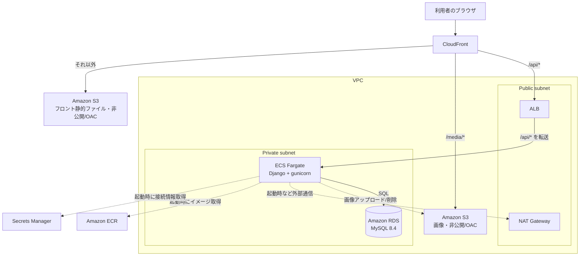

# インフラ構成書：PenAndPalette

[← 基本設計書に戻る](basic-design.md)

姉妹プロジェクト[RaiseTechSNS](../../RaiseTechSNS/docs/infrastructure-design.md)のインフラ構成（S3 + CloudFront / ECS Fargate / RDS / Secrets Manager）を踏襲し、言語・フレームワーク（Spring/PostgreSQL → Django/MySQL）と、[基本設計書 7章](basic-design.md#7-今後の検討事項)で決定済みの変更点（画像用バケットも非公開化）を反映したもの。`terraform/` 配下に Terraform コードとして実装している。

## 改訂履歴

**1.0 / 2026-08-28**
初版作成。RaiseTechSNS の構成を踏襲しつつ、(a) 画像用 S3 バケットも非公開にして CloudFront の `/media/*` ビヘイビア経由（OAC）でのみ配信、(b) 画像の S3 認証は静的 IAM アクセスキーではなく ECS タスクロール（django-storages / boto3 の既定認証チェーンが自動的に拾う）、の 2 点を RaiseTechSNS から変更した。`terraform validate` とローカルでのイメージビルド・起動確認まで実施。実際の `terraform apply` は未実施。

## 1. 方針

- 本番環境の構築において、EC2 インスタンスを直接作成・管理しない
- フロントエンド（静的ファイル）とバックエンド API（コンテナ）を分離し、それぞれ AWS のマネージドサービス上で動かす
- OS・ミドルウェアのパッチ適用やスケーリングといった運用作業は、可能な限り AWS 側に任せる
- 上記の構成は `terraform/` にコード化されており、`terraform apply` で再現・`terraform destroy` で撤去できる
- state はローカル管理（個人学習用途のため。恒久運用するなら S3 リモートバックエンド + 暗号化が必要）

## 2. 全体構成図



実線は常時発生する通信、破線は随時発生する通信。CloudFront がパス（`/api/*`・`/media/*`・それ以外）で振り分ける点がこの構成のかなめ（詳細は 4 章）。

## 3. コンポーネント一覧

### フロントエンド配信

- **Amazon S3（frontend バケット）** — Vue.js をビルドした静的ファイル。非公開にし、CloudFront（OAC）経由のみアクセス可
- **Amazon CloudFront** — S3・ALB の手前に立てる CDN。HTTPS 終端・キャッシュに加え、パスベースのルーティング（4 章）でフロント・API・画像を同一オリジンに見せる

### 画像配信（基本設計書 7章の変更点）

- **Amazon S3（media バケット）** — 投稿・コメント・アイコン画像。RaiseTechSNS のアバター用バケットは公開だったが、本プロジェクトでは**非公開**とし、CloudFront の `/media/*` ビヘイビア（OAC）経由でのみ配信する
- バックエンドの django-storages は `location="media"`・`custom_domain=<CloudFront ドメイン>`・`querystring_auth=False` の設定で、`https://<cloudfront>/media/<folder>/<uuid>.<ext>` という配信 URL を生成して DB（`post_images.image_url` 等）に保存する。S3 オブジェクトキーは `media/<folder>/<uuid>.<ext>` となり、CloudFront はパスをそのままキーとして S3 に渡せる（オリジンパスの書き換え不要）

### バックエンド API 実行

- **Amazon ECR** — `backend/Dockerfile` から作成した Docker イメージ（`linux/arm64`）を保管
- **Amazon ECS + AWS Fargate** — ECR のイメージをコンテナとして実行（ARM64 / Graviton、cpu 256・memory 512）。コンテナは起動時に `python manage.py migrate` を実行してから gunicorn を起動する
- **Application Load Balancer（ALB）** — CloudFront から転送された `/api/*` を ECS Fargate タスクへ振り分ける。ヘルスチェックは `/api/health`（`AllowAny`・DB 非依存）

### データベース

- **Amazon RDS for MySQL** — MySQL 8.4、`db.t4g.micro`。Private subnet に配置し、ECS タスクのセキュリティグループからの 3306 のみ許可。MySQL 8 は文字セットの既定が `utf8mb4` のため追加のパラメータグループは不要

### ネットワーク

- **Amazon VPC**（`10.0.0.0/16`）／ Public・Private サブネット各 2AZ ／ NAT Gateway 1 台（コスト優先）

### シークレット・認証情報

- **AWS Secrets Manager** — DB パスワードと `DJANGO_SECRET_KEY`（JWT HS256 の署名鍵も兼ねる）を保管し、ECS タスク定義の `secrets` から注入する
- **画像用 S3 の認証** — RaiseTechSNS は実装の都合で静的 IAM アクセスキーを使っていたが、Django（django-storages / boto3）は既定の認証チェーンが ECS タスクロールを自動的に拾う。そのため**静的アクセスキーは発行せず**、ECS タスクロール（`terraform/iam.tf` の `ecs_task`）に media バケットへの `s3:PutObject` / `s3:GetObject` / `s3:DeleteObject` を付与している

### 証明書・DNS

- 独自ドメインは使わず、CloudFront のデフォルトドメイン（`*.cloudfront.net`）・デフォルト証明書で運用する

## 4. フロント・API・画像の同一オリジン化（Cookie 対策）

[基本設計書の認証方式](basic-design.md#3-認証方式)のとおり、認証は HttpOnly Cookie（`access_token` / `refresh_token`）方式。フロント（CloudFront）とバックエンド API（ALB）が別ドメインになると、ブラウザの Cookie 送信制御（`SameSite` 等）の影響で認証 Cookie が正しく送信されない場合がある。

これを避けるため、CloudFront の 1 ディストリビューションに 3 オリジン（frontend S3・media S3・ALB）を設定し、パスベースのビヘイビアでルーティングする。

- `/api/*` → ALB（Django API）。`Managed-CachingDisabled` + `Managed-AllViewer`（Cookie・クエリ・ヘッダーを転送）
- `/media/*` → media S3（OAC）。`Managed-CachingOptimized`（ファイル名が UUID で不変のため積極キャッシュ）
- それ以外 → frontend S3（OAC）

ブラウザから見ると単一オリジンになるため、認証方式・Cookie 設定を変えずに運用できる。

Vue Router は history モード（`createWebHistory`）のため、`/timeline` のような拡張子なしパスをリロード・直リンクすると S3 に該当オブジェクトが無く 404 になる。デフォルトビヘイビアにのみ CloudFront Function（`spa_rewrite`）を紐づけ、拡張子を持たないリクエストを `/index.html` に書き換えて SPA に処理させる。`/api/*`・`/media/*` は別ビヘイビアのため影響を受けず、それらの 404 はそのまま返る。

### バックエンド側の対応（`backend/config/settings.py`、#44 で実装）

- **CORS**：ブラウザは同一オリジンでも状態変化リクエスト（POST/PUT/DELETE）で `Origin` ヘッダーを送る。CloudFront ドメインは apply 後まで確定しないため、完全一致ではなく `CORS_ALLOWED_ORIGIN_REGEXES=^https://.*\.cloudfront\.net$` で許可する（RaiseTechSNS が `setAllowedOriginPatterns` で行った対応と同じ）
- **CSRF**：Django admin をこのドメイン経由で使うため `CSRF_TRUSTED_ORIGINS=https://<cloudfront ドメイン>`
- **HTTPS 判定**：CloudFront〜ALB 間は HTTP だが、`Managed-AllViewer` が `CloudFront-Forwarded-Proto` ヘッダーを転送するので `SECURE_PROXY_SSL_HEADER = ("HTTP_CLOUDFRONT_FORWARDED_PROTO", "https")` で元リクエストが HTTPS だったと判定できる
- **`SECURE_SSL_REDIRECT` は False 固定**：リダイレクトは CloudFront（`redirect-to-https`）で済ませる。Django 側で行うとリダイレクトを追わない ALB ヘルスチェックが 301 を不健全と誤判定する
- **`ALLOWED_HOSTS`**：実トラフィックは `Host: <cloudfront ドメイン>`（環境変数で指定）。ALB のヘルスチェックは `Host: <コンテナのプライベート IP>` で来るため、`DEBUG=False` のとき ECS タスクメタデータからその IP を取得して `ALLOWED_HOSTS` に追加する

## 5. コスト・運用上の補足

- NAT Gateway・ALB・RDS・ECS Fargate はいずれも稼働時間で課金される。**検証後は `terraform destroy` で撤去**し、常時稼働はさせない
- RDS・ECS Fargate ともに学習規模を前提とした最小構成（`db.t4g.micro` / cpu 256・memory 512・desired_count 1）
- NAT Gateway は時間課金が発生する。学習規模なら VPC エンドポイント（ECR・S3・Secrets Manager・CloudWatch Logs 宛）への置き換えでコストを抑える選択肢もあるが、本バージョンはシンプルさを優先

## 6. 既知の妥協点

学習・検証目的なら許容できるが、恒久運用するなら見直しが必要。

- **起動時マイグレーション**：コンテナの entrypoint が `migrate` してから gunicorn を起動する。`desired_count = 1` の前提。複数タスクにスケールするなら、`migrate` は独立した ECS run-task（またはコンテナの依存関係）に分離すること
- **ALB〜CloudFront 間は HTTP**：独自ドメイン・ACM 証明書を導入しない限り解消できない（ACM は AWS 所有ドメインに証明書を発行できない）。CloudFront エッジ〜ブラウザ間は HTTPS
- **ALB の保護は CloudFront のオリジンフェイシング IP レンジ（AWS 管理プレフィックスリスト）のみ**：「自分のディストリビューション限定」ではなく「AWS 上の全 CloudFront エッジ」からの到達を許す。恒久対応は CloudFront のカスタムヘッダー共有シークレット + ALB リスナールールでの検証
- **Terraform state をローカル保存**：DB パスワード等が平文で `terraform/` 配下の tfstate に残る（`.gitignore` で誤コミットは防止済み）。恒久運用するなら S3 リモートバックエンド + 暗号化
- **HSTS 無効**：`*.cloudfront.net` は他プロジェクトと共有するドメインのため、`SECURE_HSTS_SECONDS` は既定 0。独自ドメイン導入時に有効化を検討
- **CI/CD 未整備**：ECR への push・ECS へのデプロイは下記 Runbook の手動手順。自動化は未着手（RaiseTechSNS 自身も未確定）

## 7. デプロイ手順（Runbook）

前提：AWS CLI が認証済み（`aws sts get-caller-identity` が通る）、Docker が起動している、`terraform` がインストール済み。リージョンは既定 `ap-northeast-1`。

### 7.1 インフラを構築する

```sh
cd terraform
terraform init
terraform apply
```

`apply` 後、以降の手順で使う値を控える：

```sh
terraform output
# cloudfront_domain_name / cloudfront_distribution_id / ecr_repository_url
# / frontend_bucket_name / ecs_cluster_name / ecs_service_name
```

> 初回 `apply` 時点では ECR にイメージがまだ無いため、ECS サービスのタスクは起動失敗を繰り返す。次の 7.2 でイメージを push すると回復する。

### 7.2 バックエンドイメージをビルドして push する

```sh
AWS_REGION=ap-northeast-1
ECR_URL=$(terraform -chdir=terraform output -raw ecr_repository_url)

aws ecr get-login-password --region "$AWS_REGION" \
  | docker login --username AWS --password-stdin "${ECR_URL%/*}"

# Fargate は ARM64 のため必ず linux/arm64 でビルドする
docker buildx build --platform linux/arm64 -t "$ECR_URL:latest" --push backend
```

### 7.3 ECS を新しいイメージで再デプロイする

```sh
aws ecs update-service \
  --cluster  "$(terraform -chdir=terraform output -raw ecs_cluster_name)" \
  --service  "$(terraform -chdir=terraform output -raw ecs_service_name)" \
  --force-new-deployment

# タスクが RUNNING / ヘルシーになるまで待つ
aws ecs wait services-stable \
  --cluster "$(terraform -chdir=terraform output -raw ecs_cluster_name)" \
  --services "$(terraform -chdir=terraform output -raw ecs_service_name)"
```

### 7.4 フロントエンドをビルドして配置する

```sh
CF_DOMAIN=$(terraform -chdir=terraform output -raw cloudfront_domain_name)
FRONT_BUCKET=$(terraform -chdir=terraform output -raw frontend_bucket_name)

cd frontend
# API は同一オリジンの /api/* を叩くので baseURL は空にする
VITE_API_BASE_URL="" npm run build
aws s3 sync dist/ "s3://$FRONT_BUCKET" --delete
cd ..

# CloudFront のキャッシュを無効化
aws cloudfront create-invalidation \
  --distribution-id "$(terraform -chdir=terraform output -raw cloudfront_distribution_id)" \
  --paths "/*"
```

### 7.5 動作確認

```sh
curl -sf "https://$CF_DOMAIN/api/health"          # {"status":"ok"}
open "https://$CF_DOMAIN"                          # ブラウザでアプリを開く
```

必要なら Django のスーパーユーザーを作成する（`/admin` 用）：

```sh
TASK_ARN=$(aws ecs list-tasks --cluster "$(terraform -chdir=terraform output -raw ecs_cluster_name)" \
  --service-name "$(terraform -chdir=terraform output -raw ecs_service_name)" --query 'taskArns[0]' --output text)
aws ecs execute-command --cluster "$(terraform -chdir=terraform output -raw ecs_cluster_name)" \
  --task "$TASK_ARN" --container backend --interactive \
  --command "python manage.py createsuperuser"
```

> `execute-command` を使うには ECS サービスの `enable_execute_command = true` が必要。既定では無効のため、使う場合は `terraform/ecs.tf` の `aws_ecs_service.backend` に追記して `apply` し直す。

### 7.6 撤去する

```sh
terraform -chdir=terraform destroy
```
