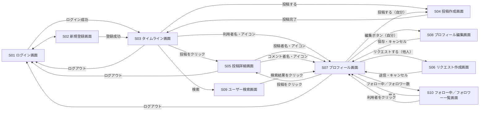

# 画面設計：PenAndPalette

[← 要件定義書に戻る](requirements.md)

## 1. 画面一覧表

| 画面ID | 画面名 | 概要 | 対応する機能 |
|---|---|---|---|
| S01 | ログイン画面 | メールアドレス・パスワードでログインする。未ログイン時の起点となる画面 | [ログイン機能](features/login.md) |
| S02 | 新規登録画面 | ユーザー名・メールアドレス・パスワードで会員登録する | [ログイン機能](features/login.md) |
| S03 | タイムライン画面 | 「全体」「フォロー中」を切り替えて投稿を一覧表示する、ログイン後のメイン画面 | [タイムライン機能](features/timeline.md) |
| S04 | 投稿作成画面 | 本文と、任意で画像を入力して投稿する | [投稿機能](features/post.md) |
| S05 | 投稿詳細画面 | 1件の投稿の内容、コメント、いいね、かきたいの状況を表示する | [投稿機能](features/post.md)、[コメント機能](features/comment.md)、[いいね機能](features/like.md)、[かきたい機能](features/want-to-create.md) |
| S06 | リクエスト作成画面 | 特定の利用者に宛ててリクエストを送る | [リクエスト機能](features/request.md) |
| S07 | プロフィール画面 | 利用者のアイコン・自己紹介・投稿一覧、フォロー中／フォロワー数を表示する。他の利用者には[リクエストする]ボタン、自分には届いたリクエストの一覧を表示する | [プロフィール機能](features/profile.md)、[フォロー機能](features/follow.md)、[リクエスト機能](features/request.md) |
| S08 | プロフィール編集画面 | 自分のアイコン・自己紹介を編集する | [プロフィール機能](features/profile.md) |
| S09 | ユーザー検索画面 | ユーザー名・表示名で他の利用者を検索する | [ユーザー検索機能](features/user-search.md) |
| S10 | フォロー中／フォロワー一覧画面 | プロフィール画面から開き、フォロー中の利用者・フォロワーの一覧を表示する | [フォロー機能](features/follow.md) |

## 1.5 画面共通仕様

- S01・S02（未ログイン時の画面）は、共通ヘッダーを持ちません。
- S03・S05・S07・S09（ログイン後、ヘッダーからいつでも行き来できるメイン画面群）は、共通ヘッダー（検索・プロフィール・ログアウト）を持ちます。ワイヤーフレームはS03のみ詳細に描いていますが、他の画面にも同じヘッダーが表示される想定です。
- S04・S06・S08・S10（他の画面から開く単機能の画面）は、完了操作または[キャンセル]／[戻る]で必ず元の画面に戻る作りのため、共通ヘッダーを持ちません。

## 2. 画面遷移図



## 3. 各画面の詳細

### S01 ログイン画面

```
+--------------------------------+
|         PenAndPalette           |
+--------------------------------+
|  メールアドレス                  |
|  [_________________________]   |
|                                 |
|  パスワード                     |
|  [_________________________]   |
|                                 |
|           [ ログイン ]           |
|                                 |
|  アカウントをお持ちでない方は     |
|  [新規登録はこちら]              |
+--------------------------------+
```

| 項目 | 内容 |
|---|---|
| 表示項目 | メールアドレス入力欄、パスワード入力欄 |
| できる操作 | ログイン、新規登録画面への遷移 |
| 遷移先 | ログイン成功→S03／[新規登録はこちら]→S02 |

### S02 新規登録画面

```
+--------------------------------+
|         新規登録                |
+--------------------------------+
|  ユーザー名                     |
|  [_________________________]   |
|                                 |
|  メールアドレス                  |
|  [_________________________]   |
|                                 |
|  パスワード                     |
|  [_________________________]   |
|                                 |
|           [ 登録する ]           |
|                                 |
|  [ログイン画面に戻る]            |
+--------------------------------+
```

| 項目 | 内容 |
|---|---|
| 表示項目 | ユーザー名・メールアドレス・パスワードの入力欄 |
| できる操作 | 会員登録、ログイン画面への遷移 |
| 遷移先 | 登録成功→S03／[ログイン画面に戻る]→S01 |

### S03 タイムライン画面

```
+------------------------------------------------------+
| PenAndPalette         [検索][プロフィール][ログアウト]  |
+------------------------------------------------------+
| [ 投稿する ]                                            |
+------------------------------------------------------+
| ↑ 3件の新しい投稿があります（クリックして表示）           |  ← 新着があるときのみ表示
+------------------------------------------------------+
| [ 全体 ]   フォロー中                                    |
+------------------------------------------------------+
| [アイコン] ユーザーA                    2026-08-20 [編集][削除] |
| 本文がここに表示される（280文字まで）                      |
| ♥ いいね 12   ✏ かきたい 6   💬 コメント 3               |
+------------------------------------------------------+
| [アイコン] ユーザーB                            2026-08-19 |
| 本文がここに表示される                                    |
| [ 画像1 ][ 画像2 ]                                       |
| ♥ いいね 27   ✏ かきたい 2   💬 コメント 5               |
+------------------------------------------------------+
|        （以下、新しい投稿から順に続く）                    |
+------------------------------------------------------+
```

| 項目 | 内容 |
|---|---|
| 表示項目 | 投稿者アイコン・名前、投稿日時、本文、画像（あれば）、いいね数、かきたい数、コメント数。自分の投稿には[編集][削除]。新着投稿があるときのみ、上部に件数を知らせるバナーを表示する |
| できる操作 | 「全体」「フォロー中」タブの切り替え、[投稿する]から投稿作成画面を開く、投稿クリックで詳細画面へ、利用者名・アイコンクリックでプロフィール画面へ、いいね・かきたいの登録／解除、（自分の投稿のみ）編集・削除、ヘッダーから検索・プロフィール画面へ、新着通知バナーのクリックで一覧の先頭に新着投稿を反映 |
| 遷移先 | [投稿する]→S04／投稿クリック→S05／利用者名・アイコン→S07／[編集]→S04／[検索]→S09 |
| 補足 | 新着通知バナーは、画面のスクロール位置によらず常に表示される。複数回の確認で新着投稿が見つかった場合は、バナーをクリックするまで件数が積み上がる |

### S04 投稿作成画面

```
+--------------------------------+
|  投稿する                       |
+--------------------------------+
|  本文（280文字まで）              |
|  [_________________________]   |
|  [_________________________]   |
|                          0/280  |
+--------------------------------+
|  画像（任意・1〜4枚）             |
|  [ 追加 ][   ][   ][   ]        |
+--------------------------------+
|           [キャンセル] [投稿する] |
+--------------------------------+
```

| 項目 | 内容 |
|---|---|
| 表示項目 | 本文入力欄（文字数カウンター付き）、画像添付欄（最大4枚分のスロット） |
| できる操作 | 本文の入力、画像の追加・削除、投稿、キャンセル |
| 遷移先 | 投稿完了→元の画面（タイムラインから開いた場合はS03、プロフィール画面から開いた場合はS07） |
| 補足 | 自分の投稿の[編集]から開いた場合は、既存の本文・画像が入力済みの状態で開き、画面の見出し・ボタンが「投稿を編集」「保存する」に変わる |

### S05 投稿詳細画面

```
+------------------------------------------------------+
| ← タイムラインに戻る                                    |
+------------------------------------------------------+
| [アイコン] ユーザーA                    2026-08-20 [編集][削除] |
| 本文がここに表示される                                    |
| [ 画像1 ][ 画像2 ]                                       |
| ♥ いいね 12   ✏ かきたい 6   💬 コメント 3               |
+------------------------------------------------------+
| コメント（3件）                                          |
|  [アイコン] ユーザーD   コメント本文がここに表示される      |
|  [アイコン] ユーザーE   コメント本文　[ 画像 ]              |
+------------------------------------------------------+
| [アイコン] コメントを入力            [画像を追加]         |
| [_______________________________________]            |
|                                        [コメントする]    |
+------------------------------------------------------+
```

| 項目 | 内容 |
|---|---|
| 表示項目 | 投稿本文・画像、投稿者情報、いいね数・かきたい数・コメント数、コメント一覧（画像付きのものを含む） |
| できる操作 | いいね・かきたいの登録／解除、コメント投稿（画像添付可）、（自分の投稿のみ）編集・削除、（自分のコメントのみ）編集・削除 |
| 遷移先 | 投稿者名・アイコン→S07／コメント者名・アイコン→S07／[編集]（投稿）→S04 |

### S06 リクエスト作成画面

```
+--------------------------------+
|  ユーザーB さんにリクエストする    |
+--------------------------------+
|  どんな作品をリクエストしますか？  |
|  [_________________________]   |
|  [_________________________]   |
|                                 |
|  参考にしてほしい投稿（任意）      |
|  [_________________________]   |
+--------------------------------+
|         [キャンセル] [リクエストする] |
+--------------------------------+
```

| 項目 | 内容 |
|---|---|
| 表示項目 | 宛先（相手の名前）、依頼内容の入力欄、参考にしてほしい投稿の入力欄（任意） |
| できる操作 | 依頼内容の入力、参考投稿の指定、送信、キャンセル |
| 遷移先 | 送信・キャンセル→S07（開いていた相手のプロフィール画面） |
| 補足 | S07（他の利用者のプロフィール画面）の[リクエストする]ボタンからのみ開く。宛先はそのプロフィール画面の利用者に固定される |

### S07 プロフィール画面

```
+------------------------------------------------------+
| ← タイムラインに戻る                                    |
+------------------------------------------------------+
| [アイコン]  ユーザーA                                    |
|             自己紹介がここに表示される                    |
|             フォロー中 12   フォロワー 8                  |
|             [ フォローする ][ リクエストする ]              |
|             ※自分の場合は[プロフィールを編集]のみ表示       |
+------------------------------------------------------+
| [ 投稿する ]  ※自分の場合のみ表示                          |
+------------------------------------------------------+
| 届いたリクエスト  ※自分の場合のみ表示                       |
|  ユーザーF さんから：「この場面の続きを書いてほしいです」    |
+------------------------------------------------------+
| ユーザーAの投稿                                          |
+------------------------------------------------------+
| 本文がここに表示される                          2026-08-20 |
| ♥ いいね 12   ✏ かきたい 6   💬 コメント 3               |
+------------------------------------------------------+
```

| 項目 | 内容 |
|---|---|
| 表示項目 | アイコン、自己紹介、フォロー中／フォロワー数、投稿一覧（新しい順）。自分の場合は届いたリクエストの一覧も表示 |
| できる操作 | （自分以外）フォロー・フォロー解除、（自分以外）リクエストする、（自分）プロフィール編集画面への遷移、（自分）投稿作成画面への遷移、フォロー中／フォロワー数クリックで一覧表示、投稿クリックで詳細画面へ |
| 遷移先 | [プロフィールを編集]→S08／[投稿する]→S04／[リクエストする]→S06／投稿クリック→S05／フォロー中・フォロワー数→S10 |

### S08 プロフィール編集画面

```
+--------------------------------+
|  プロフィールを編集              |
+--------------------------------+
|  アイコン画像                   |
|  [アイコン]  [画像を選択] [削除]  |
|                                 |
|  自己紹介                       |
|  [_________________________]   |
|  [_________________________]   |
|                                 |
|           [キャンセル] [保存]    |
+--------------------------------+
```

| 項目 | 内容 |
|---|---|
| 表示項目 | 現在のアイコン画像、自己紹介入力欄 |
| できる操作 | アイコン画像の選択・削除、自己紹介の編集、保存、キャンセル |
| 遷移先 | 保存・キャンセル→S07 |

### S09 ユーザー検索画面

```
+--------------------------------+
|  ← タイムラインに戻る            |
+--------------------------------+
|  [___________________] [検索]   |
+--------------------------------+
|  [アイコン] ユーザーA            |
|  [アイコン] ユーザーAbc          |
+--------------------------------+
```

| 項目 | 内容 |
|---|---|
| 表示項目 | キーワード入力欄、検索結果一覧（アイコン・ユーザー名） |
| できる操作 | キーワードを入力して検索、検索結果クリックでプロフィール画面へ |
| 遷移先 | 検索結果クリック→S07 |

### S10 フォロー中／フォロワー一覧画面

```
+--------------------------------+
|  ← プロフィールに戻る            |
+--------------------------------+
|  [ フォロー中 12 ]  フォロワー 8  |
+--------------------------------+
|  [アイコン] ユーザーC            |
|  [アイコン] ユーザーD            |
+--------------------------------+
```

| 項目 | 内容 |
|---|---|
| 表示項目 | 「フォロー中」「フォロワー」タブ、それぞれの人数、選択中のタブの利用者一覧（アイコン・ユーザー名） |
| できる操作 | 「フォロー中」「フォロワー」タブの切り替え、一覧の利用者クリックでその利用者のプロフィール画面へ、[プロフィールに戻る] |
| 遷移先 | 利用者クリック→S07（その利用者のプロフィール画面）／[プロフィールに戻る]→S07（元のプロフィール画面） |
| 補足 | S07（プロフィール画面）のフォロー中／フォロワー数のクリックからのみ開く。開いたときは、クリックした方のタブ（フォロー中／フォロワー）が選択された状態で表示する |
